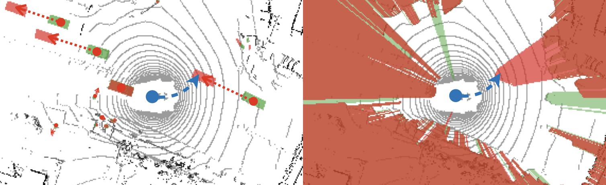

# Safe Local Motion Planning with Self-Supervised Freespace Forecasting
By Peiyun Hu, Aaron Huang, John Dolan, David Held, and Deva Ramanan

## Citing us
You can find our paper on [CVF Open Access](https://openaccess.thecvf.com/content/CVPR2021/papers/Hu_Safe_Local_Motion_Planning_With_Self-Supervised_Freespace_Forecasting_CVPR_2021_paper.pdf). If you find our work useful, please consider citing:
```
@inproceedings{hu2021safe,
  title={Safe Local Motion Planning with Self-Supervised Freespace Forecasting},
  author={Hu, Peiyun and Huang, Aaron and Dolan, John and Held, David and Ramanan, Deva},
  booktitle={Proceedings of the IEEE/CVF Conference on Computer Vision and Pattern Recognition},
  pages={12732--12741},
  year={2021}
}
```

## Setup
- Download nuScenes dataset, including the CANBus extension, as we will use the recorded vehicle state data for trajectory sampling. (Tip: the code assumes they are stored under `/data/nuscenes`.)
- Install packages and libraries (via `conda` if possible), including `torch`, `torchvision`, `tensorboard`, `cudatoolkit-11.1`, `pcl>=1.9`, `pybind11`, `eigen3`, `cmake>=3.10`, `scikit-image`, `nuscenes-devkit`. (Tip: verify location of python binary with which python.)
- Compile code for Lidar point cloud ground segmentation under `lib/grndseg` using CMake.

## Preprocessing
- Run `preprocess.py` to generate ground segmentations 
- Run `precast.py` to generate future visible freespace maps
- Run `rasterize.py` to generate BEV object occupancy maps and object "shadow" maps. 

## Training
Refer to `train.py`.

## Testing
Refer to `test.py`.

## Acknowledgements
Thanks @tarashakhurana for help with README.
